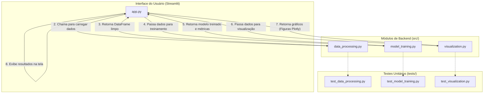

# 📈 Projeto Preditor de Indicadores Econômicos

**Membros da Equipe:**

- [Caio Azevedo Dal Porto](https://github.com/lcaioporto) - 256709
- [Eduardo Rittner Coelho](https://github.com/eduardorittner) - 250960
- [Lucas Bellusci D'Andréa](https://github.com/lucasbdandrea) - 206009
- [Vinicius Leme Soares](https://github.com/viniciuslsoares) - 260727

---

## 🏛️ Arquitetura da Solução

A aplicação é construída de forma modular para separar as responsabilidades, facilitar o desenvolvimento paralelo e garantir a testabilidade. A estrutura é orquestrada por uma aplicação principal (`app.py`) que utiliza módulos de backend para lógica de negócio.

### Diagrama de Arquitetura

O diagrama abaixo ilustra o fluxo de dados e a interação entre os componentes principais:

### Descrição dos Módulos

- **`app.py`**: O coração da aplicação. É responsável por renderizar a interface com Streamlit, gerenciar a interação do usuário (inputs da sidebar), orquestrar a chamada dos outros módulos e exibir os resultados.
- **`src/`**: Contém toda a lógica de negócio, separada por responsabilidade:
  - `data_processing.py`: Funções para buscar dados via API e realizar a limpeza e pré-processamento.
  - `model_training.py`: Funções para preparar os dados, treinar os modelos de ML, avaliar a performance e fazer predições.
  - `visualization.py`: Funções dedicadas a criar os gráficos (Plotly) que serão exibidos na interface.
- **`tests/`**: Contém os testes unitários para cada módulo de `src`. A execução desses testes é automatizada pelo pipeline de CI/CD.

---

## 🗺️ Guia de Implementação por Feature

Esta seção detalha onde e como cada uma das três features principais deve ser implementada.

### **Issue #1: Ingestão, Pré-processamento e Visualização de Dados 📈**

Esta feature foca em obter os dados brutos, limpá-los e exibir as tendências iniciais.

- **Onde Implementar:**
  - Lógica de dados: `src/data_processing.py`
  - Lógica de gráficos: `src/visualization.py`
- **Funções a Implementar e Contratos (Input/Output):**

  1.  **`fetch_world_bank_data`** (`em data_processing.py`)

      - **Assinatura:** `(countries: List[str], indicators: dict, start_year: int, end_year: int) -> pd.DataFrame`
      - **Input:** Lista de códigos de países, dicionário de indicadores, ano de início e fim.
      - **Output Esperado:** Um único DataFrame do Pandas contendo os dados para todos os países e indicadores solicitados.

  2.  **`preprocess_data`** (`em data_processing.py`)

      - **Assinatura:** `(df: pd.DataFrame) -> pd.DataFrame`
      - **Input:** O DataFrame bruto retornado pela função anterior.
      - **Output Esperado:** O mesmo DataFrame, mas sem valores ausentes (NaNs), utilizando uma estratégia de interpolação.

  3.  **`plot_indicator_trend`** (`em visualization.py`)
      - **Assinatura:** `(df: pd.DataFrame, indicator: str, title: str) -> go.Figure`
      - **Input:** O DataFrame limpo, o nome do indicador a ser plotado e um título para o gráfico.
      - **Output Esperado:** Um objeto `Figure` do Plotly contendo o gráfico de linhas da tendência do indicador.

- **Conexão com `app.py`:**
  - O `app.py` chama as duas primeiras funções dentro de `@st.cache_data def load_data()` para carregar e limpar os dados uma única vez.
  - A função `plot_indicator_trend` é chamada no corpo principal do `app.py` para exibir o gráfico do indicador que o usuário seleciona em um `st.selectbox`.
- **Testes:** Implementar os `TODO`s em `tests/test_data_processing.py` e `tests/test_visualization.py`.

### **Issue #2: Motor de Treinamento e Predição ⚙️**

Esta é a feature central de Machine Learning do projeto.

- **Onde Implementar:** `src/model_training.py`
- **Funções a Implementar e Contratos (Input/Output):**

  1.  **`prepare_data`**

      - **Assinatura:** `(df: pd.DataFrame, target_column: str, features: List[str]) -> Tuple[...]`
      - **Input:** DataFrame de um país, nome da coluna alvo (ex: 'GDP'), e lista de colunas de features.
      - **Output Esperado:** Uma tupla com 4 DataFrames/Series: `X_train`, `X_test`, `y_train`, `y_test`.

  2.  **`train_model`**

      - **Assinatura:** `(X_train: pd.DataFrame, y_train: pd.Series, model_name: str) -> Any`
      - **Input:** Dados de treino e o nome do modelo (ex: "Random Forest").
      - **Output Esperado:** Um objeto de modelo treinado (fitado) do Scikit-learn.

  3.  **`evaluate_model`**

      - **Assinatura:** `(model: Any, X_test: pd.DataFrame, y_test: pd.Series) -> Dict[str, float]`
      - **Input:** Modelo treinado e os dados de teste.
      - **Output Esperado:** Um dicionário com as métricas de performance (MAE, MSE, R² Score).

  4.  **`make_prediction`**
      - **Assinatura:** `(model: Any, last_known_features: pd.DataFrame) -> float`
      - **Input:** Modelo treinado e um DataFrame de uma linha com os dados mais recentes.
      - **Output Esperado:** Um número (float) representando o valor previsto para o próximo ano.

- **Conexão com `app.py`:**
  - Todas essas funções são chamadas em sequência dentro do bloco `if st.sidebar.button("Train Model and Predict", ...):`.
  - Os resultados (modelo, métricas, predição) são armazenados em `st.session_state` para serem exibidos na interface.
- **Testes:** Implementar os `TODO`s em `tests/test_model_training.py`.

### **Issue #3: Dashboard de Visualização dos Resultados 📊**

Esta feature é a interface que exibe os resultados do treinamento de forma clara.

- **Onde Implementar:**
  - Layout e exibição: `app.py`
  - Geração do gráfico de predição: `src/visualization.py`
- **Funções a Implementar e Contratos (Input/Output):**

  1.  **`plot_predictions_vs_actuals`** (`em visualization.py`)
      - **Assinatura:** `(y_test: pd.Series, y_pred: pd.Series, title: str) -> go.Figure`
      - **Input:** Os valores reais do conjunto de teste e os valores preditos pelo modelo.
      - **Output Esperado:** Um objeto `Figure` do Plotly que plota as duas séries para comparação visual.

- **Conexão com `app.py`:**
  - O `app.py` é o principal responsável por esta feature. Ele usa `st.metric` para exibir os scores (MAE, MSE, R²), `st.info` para a predição final, e chama `plot_predictions_vs_actuals` para exibir o gráfico comparativo.
  - Toda a lógica de exibição está no bloco `if 'metrics' in st.session_state:`, garantindo que os resultados só apareçam após o treinamento.
- **Testes:** Implementar o teste correspondente em `tests/test_visualization.py`.

---
