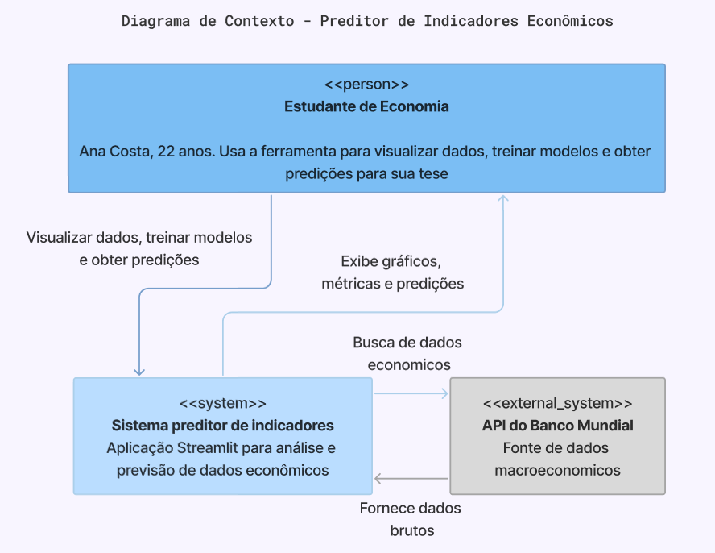
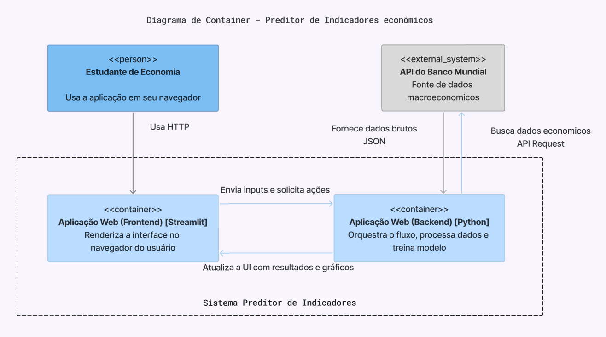

# 📈 Application for Macroeconomic Data Forecast

## 🚀 How to Run
Initially, ensure you have Python 3.13 installed on your machine.

Then, you need to clone the repository:
```bash
git clone https://github.com/viniciuslsoares/MC426.git
```
Download the dependencies:
```bash
pip install -r requirements.txt
```
And finally, execute the project locally by running from the root directory:
```bash
streamlit run src/controller/app.py
```
This command initializes a local HTTP server and opens the interactive interface in your default browser.

## 📖 About the Project

This application is an interactive tool designed to provide a **user-friendly** environment for analyzing and forecasting **macroeconomic indicators** using **ML models**. By extracting economic data for various countries from the World Bank API, it allows users to visualize historical trends and generate 5-year forecasts for critical indicators (like GDP and Population) without needing to write any code.

The data pipeline includes a preprocessing step to handle missing values, ensuring clean inputs to the models. Users can train and evaluate five classical Machine Learning methods (Linear Regression, Ridge Regression, Random Forest, Gradient Boosting, Support Vector Regression) using standard metrics like MSE and R². To generate the 5-year forecasts, the system implements a recursive strategy for **time-series data**, and SHAP values are integrated to provide **explainability** by ranking feature importance.

The project is structured using the **MVC architecture** and includes a **CI pipeline** to automate tests using the GitHub Actions Workflow.

## ✍ Requirements Elicitation
To ensure our tool solves real-world problems and makes sense in practice, we conducted a **Requirements Elicitation** process:
- **Persona**: We designed the system for "Ana Costa", an Economics student who needs to analyze trends but finds standard ML tools too complex.
- **Methodology**: We utilized **User Journey Mapping** to identify friction points (e.g., "trusting the black box") and **Agile Brainstorming** to derive features (e.g., adding SHAP values for explainability).
- **Documentation**: The full analysis, including the journey map and feature breakdown, is available in `REQUIREMENTS.md`.

It is worth noting that not all ideas from the brainstorming were implemented, but they served as the basis for building the project.

## 🏛️ Project Architecture

This project implements the **MVC (Model-View-Controller)** architectural pattern. This design choice ensures a clear separation of concerns, high modularity, and code maintainability. The application is structured as follows:

- **Model**: (`model_training.py`, `model_registry.py` and `data_processing.py`) Handles data ingestion, preprocessing, and machine learning logic.
- **View**: (`visualization.py`, `export_utils.py` and `ui_components.py`) Manages data presentation and renders interactive charts.
- **Controller**: (`app.py`) Orchestrates the application flow, serving as the bridge between the user interface, data logic, and visualization layers.

## 📐 Design of the System Architecture (C4 Model)

To ensure the system is scalable, maintainable, and easy to understand, we adopted the C4 Model for architectural documentation. This approach allows us to visualize the software at different levels of abstraction, from the high-level system context down to the individual components. All the diagrams were made in Brazilian Portuguese to fit the project requirements during the Software Engineering course.

### Context Diagram

This diagram defines the system's boundaries and its interactions with external entities.
- **User**: An "Economy Student" acts as the primary user, interacting with the system to visualize data and generate forecasts.
- **System Boundary**: The "Economic Indicators Forecaster" encapsulates the entire application logic.
- **External Dependency**: The system relies on the World Bank API to fetch real-time macroeconomic data, ensuring that our models always have access to the latest available information without local storage overhead.

 

### Container Diagram

This level zooms in to show the high-level technology choices.
- **Web Application (Frontend/Streamlit)**: Handles the rendering of the user interface directly in the browser. It is responsible for capturing user inputs and displaying the Plotly charts.
- **Web Application (Backend/Python)**: Acts as the orchestrator. It processes the business logic, manages the data flow, and executes the machine learning training pipelines.
- **Communication**: The internal communication between the frontend and backend logic is handled by Streamlit, while external data is fetched via HTTP requests to the World Bank API.



### Component Diagram
This shows the modular structure of the backend.


#### Main Application (`src/controller/app.py`) - Controller

The central hub of the Streamlit application. It manages the user interface state and coordinates module interactions.

- **Responsibilities**:
  - Renders the UI using the Streamlit framework.
  - Handles user inputs (country selection, timeframes, model parameters).
  - Manages global application state and session data.
  - Orchestrates data flow between backend models and frontend visualizations.
  - Implements caching strategies to optimize performance.

#### Data Processing (`src/model/data_processing.py`) - Model

Responsible for the ETL (Extract, Transform, Load) pipeline of economic data.

- **Responsibilities**:
  - Fetches real-time data from the World Bank Open Data API.
  - Performs data cleaning and handles missing values via interpolation techniques.
  - Generates mock data for automated testing.
  - Ensures temporal consistency of datasets for time-series analysis.

#### Model Training (`src/model/model_training.py` & `src/model/model_registry.py`) - Model

Encapsulates the Machine Learning logic, from feature engineering to inference.

- **Responsibilities**:
  - Instantiates and defines the models.
  - Executes temporal train-test splits to prevent data leakage.
  - Trains regression models (Linear Regression, Ridge Regression, Random Forest, Gradient Boosting, Support Vector Regression).
  - Evaluates performance using standard metrics (MAE, MSE, R²).
  - Generates forecasts for future economic scenarios.

#### Visualization (`src/view/visualization.py` & `src/view/ui_components.py` & `src/view/export_utils.py`) - View

The presentation layer built on top of the Plotly library.

**Responsibilities**:
  - Renders interactive time-series trends.
  - Visualizes "Predicted vs. Actual" values for model validation.
  - Displays feature importance charts for tree-based models.

## 🛡️ Tests & CI Pipeline
This application is built with an automated Continuous Integration (CI) pipeline.

### Tests

We utilize `pytest` to verify code correctness across three layers:
- **Unit Testing**: Validates individual functions in isolation.
- **Integration Testing**: Ensures that the Data, Model, and View layers interact correctly (e.g., verifying that a loaded model allows the dashboard to generate a plot).
- **Mocking**: We mock external dependencies (like the World Bank API in `test_data_processing.py`) to ensure tests are fast, deterministic, and runnable offline.

Additionally, we employed software testing techniques documented in `test_business_rules.py` to guarantee that our business logic was properly functioning:
- **Boundary Value Analysis (BVA)**: Tests edge cases in data splitting (e.g., what happens if the dataset has exactly 1 row? Or 0?).
- **Equivalence Partitioning (EP)**: Groups user inputs into valid and invalid classes.
- **Decision Tables**: Validates logic for extracting models from Pipelines and fallback priority (verifying priorities between SHAP, Tree Importances, and Linear Coefficients).

### GitHub Actions
Every `git push` triggers an automated workflow defined in `.github/workflows/ci.yml`.

This pipeline:
- Sets up a Python 3.13 environment (matching the development environment).
- Installs dependencies using `pip`.
- Executes the full tests with `pytest`.
- If any test fails, the commit is marked as broken, preventing wrong code from merging into the main branch.

## 📊 Machine Learning Prediction

To ensure model robustness and a higher prediction accuracy, this project considers time-series specific methodologies.

### Handling Non-Stationarity

Economic data (like GDP or Population) often exhibits a strong upward trend, making it non-stationary. Standard regression models would often predict values that drift indefinitely.

To solve this problem, instead of predicting the absolute value $Y_t$, our pipeline trains on the difference $\Delta Y_t = Y_t - Y_{t-1}$. As a result, the models learn the **rate of change** rather than memorizing the scale, allowing them to generalize better across different economic cycles. The final prediction is then reconstructed using the equation: $\hat{Y_t} = Y_{t-1} + \widehat{\Delta Y_t}$.

### Recursive Forecasting

Since we depend on the previous year's value to predict the current one, predicting 5 years into the future requires a dynamic approach.

To address this, we implemented a recursive strategy in which the prediction for Year $N$ is fed back into the model as an input feature for Year $N+1$. For secondary features (like population growth acting on GDP), we project their trends linearly to ensure the model has valid inputs for future years.

## 🔬 Model Explainability (XAI)

We integrated **SHAP** (SHapley Additive exPlanations) values to provide the user with insights regarding the model's decision-making process. Instead of a "black box" prediction, the application ranks features by their contribution to the forecast, helping users understand why a prediction was made.